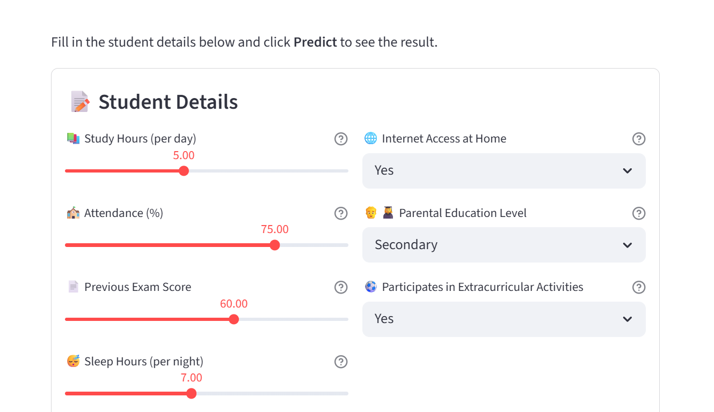

# 🎓 Student Performance Predictor

> A beginner-friendly end-to-end Data Science project that predicts student exam scores and pass/fail outcomes using Machine Learning.


---

## 📌 Description

This project builds a complete machine learning pipeline — from synthetic data generation through model training to a polished web application — to predict how well a student will perform based on:

- 📚 Study hours per day
- 🏫 Attendance percentage
- 📄 Previous exam score
- 😴 Sleep hours per night
- 🌐 Internet access at home
- 👨‍👩‍🎓 Parental education level
- ⚽ Extracurricular participation

---

## ✨ Features

- ✅ **600-row synthetic dataset** with realistic patterns and ~5% missing values
- ✅ **Data cleaning** — median imputation for missing values
- ✅ **Categorical encoding** — ordinal & binary encoding
- ✅ **Two trained models**:
  - Linear Regression → predicts final score (R² ≈ 0.83)
  - Random Forest → predicts Pass/Fail (accuracy ≈ 86%)
- ✅ **Interactive Streamlit web app** with 6 pages
- ✅ **Charts & visualisations** (distributions, heatmaps, scatter plots)
- ✅ **Saved models** using joblib

---

## 🛠️ Tech Stack

| Tool | Version | Purpose |
|------|---------|---------|
| Python | 3.10+ | Core language |
| Pandas | 2.2 | Data manipulation |
| NumPy | 1.26 | Numerical computing |
| Scikit-learn | 1.5 | ML models |
| Matplotlib | 3.9 | Plotting |
| Seaborn | 0.13 | Statistical plots |
| Streamlit | 1.35 | Web app |
| Joblib | 1.4 | Model persistence |

---

## 📁 Folder Structure

```
student-performance-predictor/
│
├── data/
│   └── student_data.csv        ← Generated dataset (600 rows)
│
├── notebooks/
│   └── analysis.ipynb          ← Exploratory Data Analysis
│
├── models/
│   ├── score_model.pkl         ← Trained Linear Regression
│   ├── pass_fail_model.pkl     ← Trained Random Forest
│   └── metrics.json            ← Saved model metrics
│
├── app.py                      ← Streamlit web application
├── train_model.py              ← Model training script
├── generate_data.py            ← Dataset generation script
├── requirements.txt            ← Python dependencies
├── README.md                   ← This file
└── .gitignore
```

---

## ⚡ Setup Instructions (macOS / Linux)

### 1. Clone or download the project
```bash
git clone https://github.com/yourusername/student-performance-predictor.git
cd student-performance-predictor
```

### 2. Create a virtual environment
```bash
python3 -m venv venv
```

### 3. Activate the virtual environment
```bash
source venv/bin/activate
```

### 4. Install dependencies
```bash
pip install -r requirements.txt
```

### 5. Generate the dataset
```bash
python generate_data.py
```

### 6. Train the models
```bash
python train_model.py
```

### 7. Run the web app
```bash
streamlit run app.py
```

The app will open at **http://localhost:8501** in your browser.

---

## 🖥️ Screenshots


| Home Page | Prediction Page |
|-----------|----------------|
|  |  |

---

## 🔮 Future Improvements

- [ ] Add more real-world features (tutoring hours, transport time, etc.)
- [ ] Try XGBoost or a Neural Network
- [ ] Add PDF report download for predictions
- [ ] Connect to a real public dataset (e.g. UCI Student Performance Dataset)
- [ ] Deploy to [Streamlit Cloud](https://streamlit.io/cloud) for free hosting
- [ ] Add a "What-if" analysis slider tool
- [ ] Multi-language support

---

## 📜 License

This project is licensed under the **MIT License** — feel free to use and modify it for learning.

---

## 👤 Author

Built as a beginner Data Science portfolio project.  
Feel free to ⭐ star this repository if you found it helpful!
